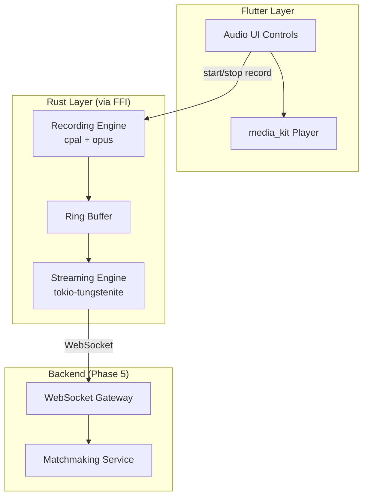

# Iqrah Audio Architecture

Document Version: 1.0  
Date: 2026-01-02

## Overview

This document defines the audio infrastructure for Iqrah, covering:
1. **Playback** - Quran recitations (media_kit, Flutter-side)
2. **Recording** - User recitations (Rust-side)
3. **Streaming** - Real-time WebSocket transmission (Rust-side)

---

## Architecture Diagram



---

## Phase 1: Playback (Flutter - media_kit)

**Status:** To implement now

| Component | Library | Notes |
|-----------|---------|-------|
| Audio Player | `media_kit` | libmpv-based, excellent Linux support |
| State Management | Riverpod | Expose player state to UI |

**Responsibilities:**
- Stream Quran recitations from QuranicAudio CDN
- Gapless playback (future: continuous surah play)
- Seek, pause, resume, speed control

---

## Phase 2: Recording (Rust - cpal + opus)

**Status:** Design only (implement with Phase 5)

### Rust Crates

| Crate | Purpose |
|-------|---------|
| `cpal` | Cross-platform audio input |
| `opus` | Low-latency audio encoding |
| `ringbuf` | Lock-free ring buffer for audio chunks |

### API Surface (via flutter_rust_bridge)

```rust
// Start recording, returns handle
pub fn start_recording() -> RecordingHandle;

// Stop recording, returns final audio buffer
pub fn stop_recording(handle: RecordingHandle) -> Vec<u8>;

// Get recording level (for visualizations)
pub fn get_recording_level(handle: RecordingHandle) -> f32;
```

### Audio Pipeline

```
Microphone → cpal → Ring Buffer → opus encoder → Chunk Queue
                                                      ↓
                                            WebSocket Sender
```

---

## Phase 3: Streaming (Rust - WebSocket)

**Status:** Design only (implement with Phase 5)

### Protocol

| Field | Type | Description |
|-------|------|-------------|
| `type` | string | `"audio_chunk"`, `"session_start"`, `"session_end"` |
| `session_id` | uuid | Matchmaking session ID |
| `chunk_id` | u32 | Sequence number |
| `data` | bytes | Opus-encoded audio (20ms frames) |
| `timestamp` | u64 | Unix timestamp in ms |

### Flow

1. Client calls `start_recording()` → Rust begins capturing
2. Rust encodes chunks (20ms Opus frames)
3. Chunks queued for WebSocket transmission
4. Backend receives and broadcasts to session peers
5. Peers decode and play back in real-time

---

## Integration with Backend Phases

| Backend Phase | Audio Dependency |
|---------------|------------------|
| Phase 0 (Foundation) | None |
| Phase 1 (Packs) | None |
| Phase 2 (Auth/Sync) | None |
| Phase 5 (Matchmaking) | Recording + Streaming APIs |

---

## File Structure (Future)

```
rust/crates/
├── iqrah-api/src/
│   ├── audio/
│   │   ├── mod.rs
│   │   ├── recorder.rs      # cpal + opus recording
│   │   ├── streamer.rs      # WebSocket sender
│   │   └── types.rs         # RecordingHandle, AudioChunk
```

---

## Open Questions

1. **Noise suppression** - Use `nnnoiseless` (Rust port of RNNoise)?
2. **Echo cancellation** - Required for group sessions?
3. **Latency target** - 100ms? 200ms?

---

## Next Steps

1. ✅ Implement media_kit for playback (now)
2. ⏳ Implement backend Phase 0-2
3. ⏳ Implement recording + streaming with Phase 5
