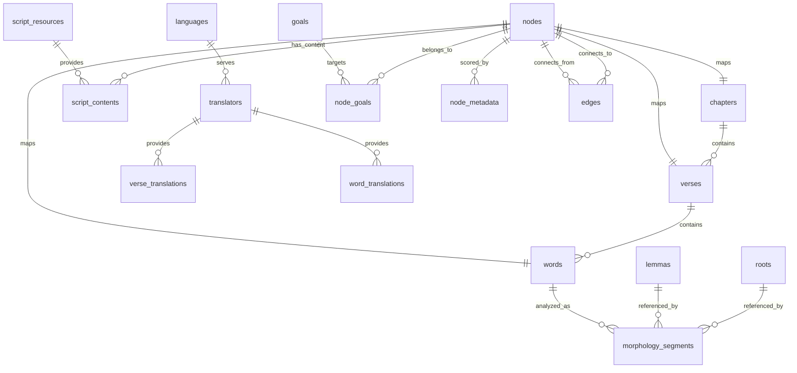

# Content Database Schema (v2.1)

**Version:** 2.1.0  
**Status:** Production-ready schema; data seeded only in tests  
**Date:** 2025-11-27

This document describes the current content.db schema after Task 1.6. The schema is metadata-first, uses integer node IDs, and stores all text through a resource pattern (no hardcoded text columns in `verses` or `words`). The production migration is schema-only; test data is seeded via `init_test_content_db` in Rust tests.

## Design Goals
- Resource pattern: all script-dependent text lives in `script_contents` keyed by integer `resource_id` + `node_id`.
- Metadata-only structure tables (`chapters`, `verses`, `words`) with no text columns.
- Integer foreign keys throughout for fast joins on mobile SQLite.
- Translation and morphology tables remain relational and script-agnostic.
- Test data separated from production migrations (seeded in `src/content/test_data.rs`).

## Table Inventory (v2.1)
- **schema_version**: version tracking (2.1.0).
- **nodes**: registry of all content nodes (`id`, `ukey`, `node_type`).
- **chapters**: chapter metadata.
- **verses**: verse metadata (no text).
- **words**: word metadata (no text).
- **script_resources**: registry of script/content resources (e.g., `uthmani`, `simple`, `transliteration`).
- **script_contents**: text payloads keyed by (`resource_id`, `node_id`).
- **languages**: language catalog.
- **translators**: translators tied to a language.
- **verse_translations** / **word_translations**: translations linked to translators.
- **roots**, **lemmas**, **morphology_segments**: morphology and linguistic analysis.
- **goals**, **node_goals**, **node_metadata**, **edges**: scheduler v2 knowledge-graph metadata.

## Resource Pattern

```
script_resources(resource_id PK, slug UNIQUE, type, direction, name, description)
script_contents(resource_id FK -> script_resources, node_id FK -> nodes, text_content, PRIMARY KEY(resource_id, node_id)) WITHOUT ROWID
```

- Add new scripts (e.g., `indopak`, `tajweed`) by inserting into `script_resources`; no schema changes required.
- All Quranic text (verses and words) is stored in `script_contents`, looked up by `node_id` and `resource` slug.

## Core Relationships (Mermaid)



## Table Highlights

- **nodes**: integer `id` (i64 encoded), `ukey` (e.g., `VERSE:1:1`), `node_type` (int).
- **chapters**: `chapter_number` PK; names, revelation info, counts; no text in verses/words.
- **verses**: PK `verse_key`, metadata (`chapter_number`, `verse_number`, juz/hizb/page/manzil, counts); UNIQUE (chapter_number, verse_number).
- **words**: PK `word_id`, FK `verse_key`, position, counts; no text columns.
- **script_resources**: PK `resource_id`, `slug` UNIQUE, `type` (1=text, 2=vector/JSON, 3=image, 4=audio), `direction`.
- **script_contents**: PK (`resource_id`, `node_id`), `text_content`; FK to `script_resources` and `nodes`; WITHOUT ROWID.
- **translations**: verse/word translations keyed by translator; `languages` drives translator `language_code`.
- **morphology**: `roots`, `lemmas`, `morphology_segments` link to `words`.
- **scheduler**: `goals`, `node_goals`, `node_metadata`, `edges` support scheduling/graph metadata.

## Access Patterns (examples)

- Quranic text (default script):
  ```sql
  SELECT sc.text_content
  FROM script_contents sc
  JOIN script_resources sr ON sr.resource_id = sc.resource_id
  WHERE sc.node_id = ? AND sr.slug = 'uthmani';
  ```
- Translation lookup:
  ```sql
  SELECT vt.translation
  FROM verse_translations vt
  JOIN translators t ON t.translator_id = vt.translator_id
  WHERE vt.verse_key = ? AND t.language_code = ?;
  ```

## Test Data vs Production
- Production migration: schema-only (`migrations_content/20241126000001_unified_content_schema.sql`).
- Test seeding: `rust/crates/iqrah-storage/src/content/test_data.rs`, used via `init_test_content_db` in tests; seeds sample chapters/verses/words, three script resources (`uthmani`, `simple`, `transliteration`), script_contents, languages/translators, translations, and scheduler metadata.

## Notes & Gaps
- Package catalog tables are not part of the v2.1 base migration; repository APIs that mention packages expect data from future content packages.
- Script selection in the repository currently defaults to the `uthmani` slug; additional scripts can be exposed by adding a slug parameter or helper when needed.
